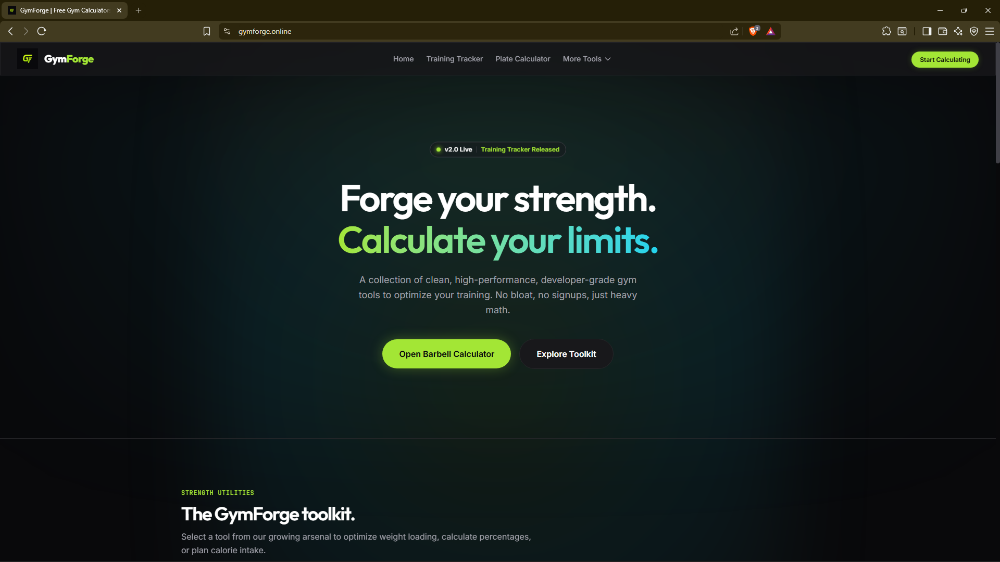
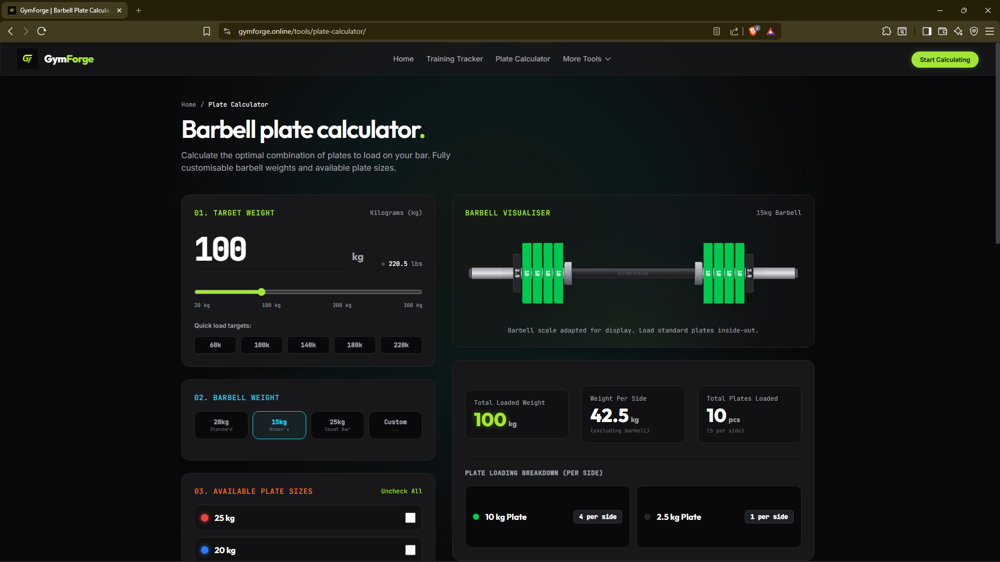
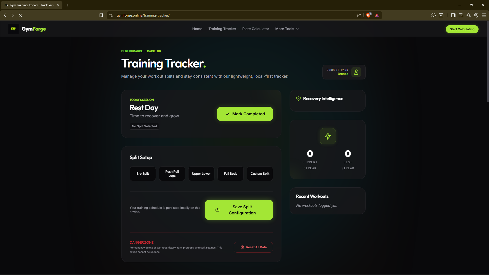

# 💪 GymForge

A modern fitness web application built with Astro to help users calculate fitness metrics, track workouts, and improve their training.

---

## 🌐 Live Demo

https://gymforge.online

---

## ✨ Features

- 🏋️ Training Tracker
- 💪 One Rep Max Calculator
- 🥩 Protein Calculator
- 🔥 Calorie Calculator
- 📈 Progressive Overload Calculator
- 🏆 Strength Standards
- 📱 Responsive Design
- ⚡ Fast Performance

---

## 🛠️ Tech Stack

- Astro
- HTML5
- CSS3
- JavaScript
- Cloudflare Pages

---

## 🚀 Installation

```bash
git clone https://github.com/amanverma1807/gymforge.git
cd gymforge
npm install
npm run dev

```

## 📸 Screenshots

### Home Page



### Protein Calculator



### Training Tracker



---

## 📂 Project Structure

```
src/
 ├── components/
 ├── pages/
 ├── styles/
public/
```

---

## 🎯 Future Improvements

- User Accounts
- Workout History
- Progress Charts
- Dark/Light Theme
- AI Workout Recommendations

---

## 👨‍💻 Author

**Aman Verma**

GitHub: https://github.com/amanverma1807

Portfolio: https://amanverma.online

LinkedIn: (Add after creating)

---

## ⭐ Support

If you like this project, give it a ⭐ on GitHub.